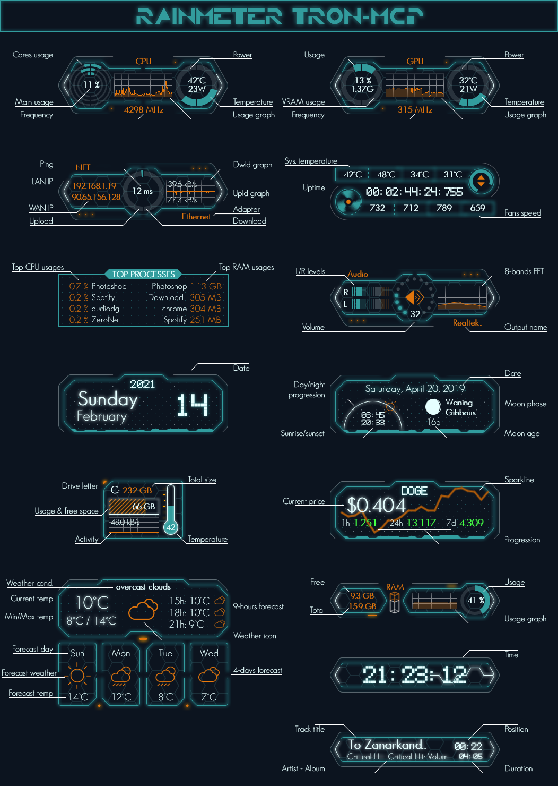

# Rainmeter Tron-MCP

Full featured Rainmeter monitoring suite inspired by Tron movies.

## Installation

You will need :

* Rainmeter 4.3
* HWiNFO
* https://openweathermap.org API key
* https://coinmarketcap.com API key

After loading and arranging the widgets at your will, right click on any widget to access the configuration window and the HWiNFO memory viewer (usefull to find `SensorId`, `SensorInstance` and `EntryId` values).

## Features

## License

Code under MIT License.
